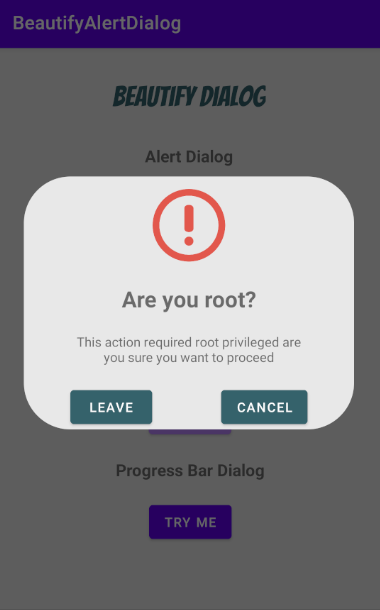
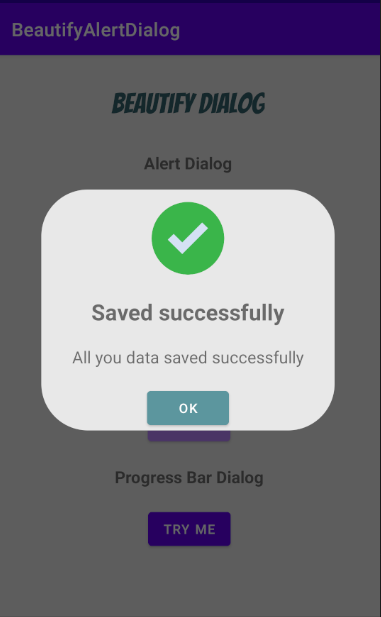
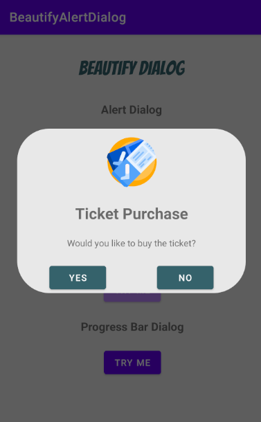

# Beautify-Alert-Dialog


Library for creating custom alert dialog which offers an adaptive UI support. 
It’s functionality is almost similar to the native AlertDialog.
Flexible and easy control over multiple part of the layout such as icon, buttons, messages and color such that you could  
customize the ui with multiple pre-built features.
The library also include animation for icons.


## Setup
Step 1. Add it in your root build.gradle at the end of repositories:
```gradle
allprojects {
    repositories {
        maven { url 'https://jitpack.io' }
    }
}
```

Step 2. Add the dependency:
```gradle
dependencies {
      implementation 'com.github.JoniKarta:BeautifyAlertDialog:1.0.1'
}
```
## Usage

###### Basic Alert Dialog:
```java

 new BeautifyAlertDialog
      .Builder(this)
      .setHeader("Are you root?")
      .setMessageContent("This action required root privileged are you sure you want to proceed")
      .setLeftButtonText("Leave")
      .setRightButtonText("Cancel")
      .setIcon(R.drawable.alert)
      .setImageAnimation(Animator.FADE_IN)
      .setOnConfirmListener(BeautifyCompleteDialog.Builder::dismiss)
      .setOnCancelListener(BeautifyCompleteDialog.Builder::dismiss)
      .show());
```

###### Basic Success Dialog:
```java

BeautifyCompleteDialog.Builder dialog = new BeautifyCompleteDialog.Builder(this);
  dialog.setHeader("Saved successfully")
      .setMessageContent("All you data saved successfully")
      .setIcon(R.drawable.success)
      .setOnSuccessClickListener(builder -> dialog.dismiss())
      .setImageAnimation(Animator.ROTATE)
      .show();
                    
```

###### Basic Custom Dialog With Inner Dialog
```java                    

new BeautifyAlertDialog
      .Builder(this)
      .setHeader("Ticket Purchase")
      .setMessageContent("Would you like to buy the ticket?")
      .setLeftButtonText("Yes")
      .setRightButtonText("No")
      .setIcon(R.drawable.tickets)
      .setImageAnimation(Animator.FADE_IN)
      .setOnConfirmListener(beautifyCompleteDialog ->
                            beautifyCompleteDialog
                              .setIcon(R.drawable.success)
                              .setMessageContent("Thanks see you there!")
                              .setOnSuccessClickListener(builder -> beautifyCompleteDialog.dismiss())
                              .show())
      .setOnCancelListener(beautifyCompleteDialog -> 
                            beautifyCompleteDialog
                               .setIcon(R.drawable.sad)
                               .setMessageContent("Hope to see you next time!")
                               .setOnSuccessClickListener(builder -> beautifyCompleteDialog.dismiss())
                               .show())
       .show());
```


<div>
      
      
      
      
</div>

## License

    Copyright 2020 Jonathan Karta

    Licensed under the Apache License, Version 2.0 (the "License");
    you may not use this file except in compliance with the License.
    You may obtain a copy of the License at

       http://www.apache.org/licenses/LICENSE-2.0

    Unless required by applicable law or agreed to in writing, software
    distributed under the License is distributed on an "AS IS" BASIS,
    WITHOUT WARRANTIES OR CONDITIONS OF ANY KIND, either express or implied.
    See the License for the specific language governing permissions and
    limitations under the License.

## Next Updates:
- [ ] Progress Bar
- [ ] New Animations 
